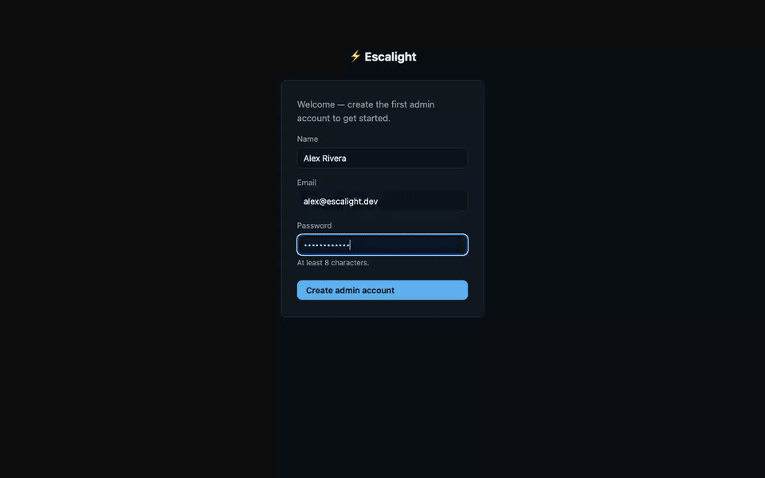
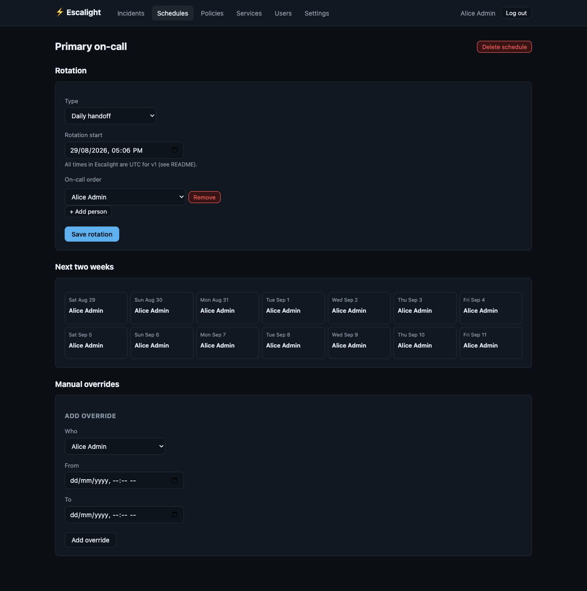

<div align="center">


**Escalight** — self-hosted on-call escalation and paging: define who gets notified, wait,
then escalate — over email, Slack, Discord, or a real push notification with an Acknowledge
button on the lock screen. No per-seat fee, no phone bill, one binary.

[](https://github.com/Laaaaksh/escalight/stargazers)
[](#why-escalight)

[](https://github.com/Laaaaksh/escalight/actions/workflows/ci.yml)
[](https://github.com/Laaaaksh/escalight/releases)
[](LICENSE)
[](go.mod)

**[Install](#install) • [Usage](#usage) • [Configuration](#configuration) • [Changelog](CHANGELOG.md) • [Contributing](CONTRIBUTING.md) • [License](LICENSE)**

**[Code of conduct](CODE_OF_CONDUCT.md) • [Security](SECURITY.md)**

</div>

## Demo



The clip shows the full escalation loop: creating a service, an on-call schedule, and a
two-level escalation policy, then firing a real incident at the ingest webhook and watching it
page the primary on-call, escalate to the secondary responder when unacknowledged, then get
acknowledged and resolved with the timeline visible throughout. Full quality:
[docs/assets/demo.mp4](docs/assets/demo.mp4).

## What it does

- **Escalation policies**: notify person A, wait N minutes, escalate to person B, repeat or
  stop — with a per-step choice of email, Slack, Discord, and/or push.
- **On-call schedules**: daily or weekly rotations with a two-week calendar view, plus
  one-off manual overrides for "Bob covers Friday instead of Alice."
- **Alert ingestion** from a generic JSON webhook, Prometheus Alertmanager, or an inbound
  email provider (Postmark, Mailgun, SendGrid) — no bespoke integration code needed for the
  two most common setups.
- **Real push notifications**: an installable PWA with web push (VAPID) — a page shows up on
  your phone's lock screen with the alert's actual title and an **Acknowledge** button that
  fires right from the notification, no app open required.
- **Acknowledge/resolve from anywhere**: the web UI, the push notification itself, or a Slack
  `/escalight ack <id>` slash command.
- **An incident timeline**: who was paged, when, and what they did — the minimum audit trail
  you need after a 3am page, not a full postmortem tool.
- **One binary, one SQLite file**: `go build`, run it, done. No Postgres, no Redis, no Node.js
  build step.

<div align="center">

</div>

*The schedule page: a daily/weekly rotation editor above a two-week calendar showing who's
on call each day, plus manual overrides below.*

## Why Escalight

**Opsgenie is being discontinued** by Atlassian, forcing existing customers to migrate right
now. **PagerDuty** charges $21–41/user/month (plus a ~$699/month AIOps add-on), which punishes
exactly the teams growing fast enough to need real on-call discipline. The one credible free
alternative, [GoAlert](https://github.com/target/goalert), is actively maintained but
deliberately bare-bones — no mobile push, a utilitarian UI most non-engineers bounce off. The
other prior free option, [Grafana OnCall](https://github.com/grafana/oncall), was archived in
March 2026. Escalight aims to sit between GoAlert's minimalism and a full observability
platform: paging that works, self-hosted, free.

## Requirements

- Go 1.26+ to build from source (or use the Docker image / a release binary — no Go needed
  then)
- A place to run one small binary or container — no managed database, no external queue

## Install

**From source** (the only path available today — no tagged release has been published yet,
so the Docker image and release binaries below don't exist):

```bash
git clone https://github.com/Laaaaksh/escalight.git
cd escalight
go build -o escalight .
./escalight serve
```

**Docker / release binary (coming soon):** once the first tagged release ships, `docker run
ghcr.io/laaaaksh/escalight:latest` and a binary on the
[Releases](https://github.com/Laaaaksh/escalight/releases) page will also work — see
[CONTRIBUTING.md](CONTRIBUTING.md#releases) for how a release is cut.

## Usage

Visit `http://localhost:8080` — the first run redirects you to a setup page to create an
admin account. Then:

1. **Create an escalation policy** (Policies → New policy): who gets notified, in what order,
   with how long to wait between steps.
2. **Create a service** (Services → New service) and attach the policy — this gives you a
   webhook URL for a generic JSON alert, an Alertmanager-shaped webhook, and an email-in
   webhook.
3. **Fire a test alert:**

   ```bash
   curl -X POST http://localhost:8080/webhooks/generic/<service-webhook-key> \
     -H 'Content-Type: application/json' \
     -d '{"title":"disk full on db-1","description":"/var is at 98%"}'
   ```

4. Watch it show up under Incidents, get escalated per your policy, and acknowledge it from
   the incident page (or from a push notification, once you've enabled push in Settings).

Optionally, add a **schedule** (Schedules → New schedule) with a daily/weekly rotation, then
point an escalation step at "On-call: `<schedule name>`" instead of a specific person.

## Configuration

Escalight is configured entirely through environment variables — there's no config file.

| Variable | Default | Purpose |
| --- | --- | --- |
| `ESCALIGHT_ADDR` | `:8080` | Listen address |
| `ESCALIGHT_BASE_URL` | `http://localhost:8080` | Public URL, used in email/Slack/push links |
| `ESCALIGHT_DB_PATH` | `escalight.db` | SQLite database file path |
| `ESCALIGHT_SMTP_HOST`, `_PORT`, `_USER`, `_PASS`, `_FROM` | unset | Enable email notifications via any SMTP relay |
| `ESCALIGHT_SLACK_WEBHOOK_URL` | unset | Enable Slack notifications (Incoming Webhook URL) |
| `ESCALIGHT_SLACK_SIGNING_SECRET` | unset | Verifies the `/escalight` slash command's requests |
| `ESCALIGHT_DISCORD_WEBHOOK_URL` | unset | Enable Discord notifications |
| `ESCALIGHT_VAPID_SUBJECT` | `mailto:admin@localhost` | Contact URL required by the Web Push protocol |

Web push needs no configuration — VAPID keys are generated automatically on first boot and
persisted in the database. Each user enables it for their own device from **Settings**.

Slack's slash command (`/escalight ack <id>` / `/escalight resolve <id>`) needs a Slack app
with its Request URL set to `<base-url>/integrations/slack/commands` and the signing secret
above configured; the incoming-webhook notifications work with just the webhook URL, no app
needed.

See [docs/EMAIL_INTEGRATION.md](docs/EMAIL_INTEGRATION.md) for wiring up email-to-alert with
Postmark, Mailgun, or SendGrid.

## Limitations

Escalight is v1 and self-hosted first. Known gaps, stated plainly rather than discovered the
hard way:

- **No release artifacts yet.** No tagged release exists, so the Docker image and prebuilt
  binaries don't exist — building from source is the only install path today. See
  [Install](#install).
- **Schedules are UTC-only.** Rotation and override times don't convert per user or per
  schedule timezone yet, even though a `Timezone` field exists on schedules for the future.
- **No SMS or voice paging.** Those need a paid telephony provider (Twilio et al.), which
  would break the no-per-seat-fee premise — out of scope for v1, not silently assumed.
- **Session-cookie auth only.** Email+password, no SSO/OAuth/SAML — a deliberate v1 cut to
  spend the available time on the escalation engine and notification channels instead.
- **No native mobile app.** The installable PWA delivers real lock-screen push notifications
  with an Acknowledge button, but there's no App Store/Play Store app.
- **No postmortem or retrospective tooling.** The incident timeline is an audit trail of who
  was paged and what they did — not a postmortem document, template, or report generator.

## Changelog

See [CHANGELOG.md](CHANGELOG.md).

## Contributing

See [CONTRIBUTING.md](CONTRIBUTING.md) for the build/test/PR workflow.

## Security

See [SECURITY.md](SECURITY.md) for supported versions and how to report a vulnerability
privately.

## Star this repo

If Escalight is useful to you, [star it](https://github.com/Laaaaksh/escalight/stargazers) —
it helps others evaluating a PagerDuty/Opsgenie replacement find it.

## License

[MIT](LICENSE)
